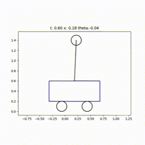
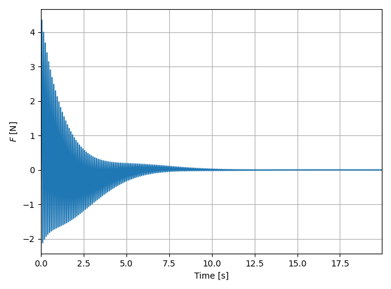
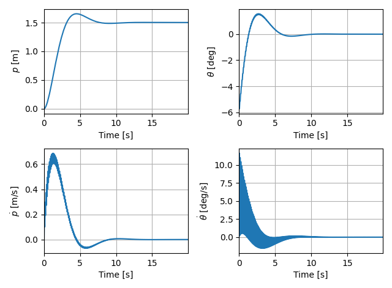

# Overview
This repository includes path following prrograms usig Linear-quadratic Regulator. 

# References
- https://qiita.com/taka_horibe/items/5d053cdaaf4c886d27b5
- https://qiita.com/trgkpc/items/8210927d5b035912a153

# Install
1. Clone this repository. 
```
$ git clone git@github.com:kosei1515/linear-quadratic_regulator.git
```

2. Go to the path where this repository is cloned.
```
$ cd path/to/linear-quadratic_regulator
```

3. Test your environment. 
```
$  python -m pytest tests
```


# Usage
Try example.
```
$ python ./linear_quadratic_regulator/inverted_pendulum.py ./config/inverted_pendulum.yaml
```

You can see outputs like these.

Move of the inverted pendulum.



History of the input $\boldsymbol{u}$.



History of the state $\boldsymbol{x}$




If you use your own config file, put this command.
```
$ python ./linear_quadratic_regulator/inverted_pendulum.py <your config file path>
```


# Parameters
See [the config example yaml](config/inverted_pendulum.yaml).
## Phisical parameters.
|Name|Description|Default|
|--------------|--------------|---------------|
|`phisical_parameters.g`|Gravitational acceleration.|`9.80665`|
|`phisical_parameters.m1`|The Mass of the cart.|`1.0`|
|`phisical_parameters.m2`|The Mass of the point|`0.1`|
|`phisical_parameters.l`|The Length of the stick between the cart and the point.|`0.8`|
|`phisical_parameters.external_force`|The external force to the cart.|`0`|

## LQR parameters.
|Name|Description|Default|
|--------------|--------------|---------------|
|`lqr.Q`|Q matrix for LQR|`[[1.0, 0.0, 0.0, 0.0], [0.0, 800.0, 0.0, 0.0], [0.0, 0.0, 10.0, 0.0], [0.0, 0.0, 0.0, 20.0]]`|
|`lqr.R`|R matrix for LQR|`[[0.44332]]`|

## Parameters for simulation
|Name|Description|Default|
|--------------|--------------|---------------|
|`simulation.terminal_time`|The time length of the simulation [s].|`20`|
|`simulation.discrete_time`|The discrete time length of the simulation [s].|`0.05`|
|`simulation.x0`|The initial value of the state $\boldsymbol{x}$ .|`[0.0, -0.1, 0.0, 0.0]`|


# Inverted Pendulum
## Reference
https://qiita.com/acela86/items/83e34d35bd1f4f98e794


## EOM
Using Lagrangian equations,

$$
L=\frac{1}{2}m_1 v_1^2 + \frac{1}{2} m_2v_2^2 - m_2gl\cos{\theta},
$$

where $v_1$ is the velocity of the cart and $v_2$ is the velocity of the point mass $m
_2$.

$v_{1}$ and $v_{2}$ can be expressed in terms of $x$ and $\theta$ by writing the velocity as the first derivative of the position;

$$
v_1^2=\dot{p}^2
c_2^2=(\frac{d}{dt}(x-l\sin\theta))^2+(\frac{d}{dt}l\cos \theta)^2.
$$

Simplifying the expression for $v_2$ leads to:

$v_2^2=\dot{x}^2-2l\dot{x}\dot\theta\cos\theta+l^2\dot{\theta}^2.$

Lagrange isn now given by:

$$
L=\frac{1}{2}(m_1+m_2)\dot{x}^2-m_2l\dot{x}\dot{\theta}\cos\theta+\frac{1}{2}m_2l^2\dot\theta^2.
$$

After getting above, we can also use Euler lagrange equation to solve for equation of motion.

$$
\frac{\partial\mathcal L}{\partial x}-\frac{d}{dt} (\frac{\partial \mathcal L}{\partial \dot x})=0, \\
\frac{\partial\mathcal L}{\partial \theta}-\frac{d}{dt} (\frac{\partial \mathcal L}{\partial \dot \theta})=0 .
$$

Using Euler-Lagrange equation, the equation of motion is given by:

$$
(m_1+m_2)\ddot x - ml\ddot\theta\cos\theta + ml\dot\theta^2\sin\theta=F,\\
l\ddot\theta-g\sin\theta=\ddot x\cos\theta.
$$


## State equation
State vector and Input vector.

$\boldsymbol{x}=[p,\theta,\dot{p},\dot{\theta}]^T, \boldsymbol{u}=[F]$

Non-linear state equation is defined as:

$$
\boldsymbol{\dot{x}}=f(\boldsymbol{x},\boldsymbol{u})=
\begin{bmatrix} 
\dot{p} \\
\dot{\theta} \\
\frac{-lm_2 \sin(\theta)\dot{\theta}\cos(\theta)}{m_1+m_2\sin^2(\theta)} \\
\frac{g(m_1+m_2)\sin\theta-(lm_2\sin(\theta)\dot\theta^2-F)\cos(\theta)}{l(m_1+m_2\sin^2(\theta))}\end{bmatrix}
$$

Linialized state equation is given by:

$$
\dot{x}=A\boldsymbol{x}+B\dot{u}=\begin{bmatrix}
0 & 0 & 1 & 0 \\
0 & 0 & 0 & 1 \\
0 & \frac{gm_2}{m_1} & 0 & 0 \\
0 & \frac{g(m_1+m_2)}{lm_1} & 0 & 0 \\
\end{bmatrix}\boldsymbol{x}+\begin{bmatrix}0 \\
0 \\ 
\frac{1}{m_1} \\
\frac{1}{lm_1}\end{bmatrix}\boldsymbol{u}.
$$

