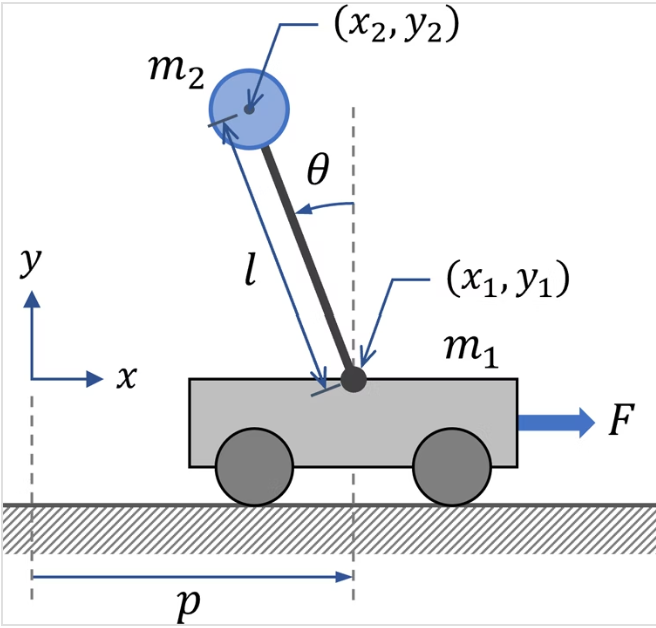

# Overview
This repository includes path following prrograms usig Linear-quadratic Regulator. 

# References
- https://qiita.com/taka_horibe/items/5d053cdaaf4c886d27b5
- https://qiita.com/trgkpc/items/8210927d5b035912a153

# Inverted Pendulum
## Reference
https://qiita.com/acela86/items/83e34d35bd1f4f98e794

## EOM
Using Lagrangian equations,

$L=\frac{1}{2}m_1 v_1^2 + \frac{1}{2} m_2v_2^2 - m_2gl\cos{\theta},$

where $v_1$ is the velocity of the cart and $v_2$ is the velocity of the point mass $m
_2$.

$v_{1}$ and $v_{2}$ can be expressed in terms of $x$ and $\theta$ by writing the velocity as the first derivative of the position;

$v_1^2=\dot{p}^2
c_2^2=(\frac{d}{dt}(x-l\sin\theta))^2+(\frac{d}{dt}l\cos \theta)^2.$

Simplifying the expression for $v_2$ leads to:

$v_2^2=\dot{x}^2-2l\dot{x}\dot\theta\cos\theta+l^2\dot{\theta}^2.$

Lagrange isn now given by:

$L=\frac{1}{2}(m_1+m_2)\dot{x}^2-m_2l\dot{x}\dot{\theta}\cos\theta+\frac{1}{2}m_2l^2\dot\theta^2.$

After getting above, we can also use Euler lagrange equation to solve for equation of motion.

$\frac{\partial\mathcal L}{\partial x}-\frac{d}{dt} (\frac{\partial \mathcal L}{\partial \dot x})=0, \\
\frac{\partial\mathcal L}{\partial \theta}-\frac{d}{dt} (\frac{\partial \mathcal L}{\partial \dot \theta})=0.$

Using Euler-Lagrange equation, the equation of motion is given by:

$(m_1+m_2)\ddot x - ml\ddot\theta\cos\theta + ml\dot\theta^2\sin\theta=F,\\
l\ddot\theta-g\sin\theta=\ddot x\cos\theta.$

## State equation
State vector and Input vector.

$\bm{x}=[p,\theta,\dot{p},\dot{\theta}]^T, \bm{u}=[F]$

Non-linear state equation is defined as:

$\bm{\dot{x}}=f(\bm{x},\bm{u})=\left[
\begin{matrix} 
\dot{p} \\
\dot{\theta} \\
\frac{-lm_2 \sin(\theta)\dot{\theta}\cos(\theta)}{m_1+m_2\sin^2(\theta)} \\
\frac{g(m_1+m_2)\sin\theta-(lm_2\sin(\theta)\dot\theta^2-F)\cos(\theta)}{l(m_1+m_2\sin^2(\theta))}
\end{matrix}  
\right].$

Linialized state equation is given by:

$\dot{x}=A\bm{x}+B\dot{u}=\left[
\begin{matrix}
0 & 0 & 1 & 0 \\
0 & 0 & 0 & 1 \\
0 & \frac{gm_2}{m_1} & 0 & 0 \\
0 & \frac{g(m_1+m_2)}{lm_1} & 0 & 0 \\
\end{matrix}
\right
]\bm{x}
+\left[
\begin{matrix}
0 \\
0 \\ 
\frac{1}{m_1} \\
\frac{1}{lm_1}
\end{matrix}
\right]\bm{u}.$

